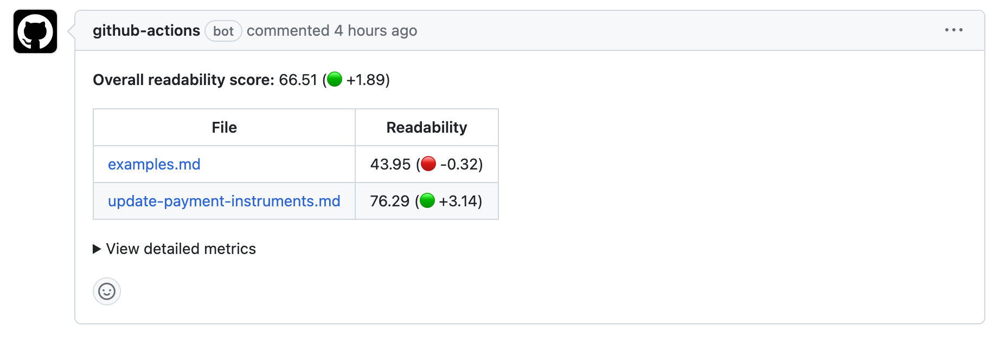

<p align="center">
  <picture>
    <source srcset="images/logo_b&w_dark.png" media="(prefers-color-scheme: dark)">
    
  </picture>
</p>
Use Lexi to reduce the complexity of the language in your documentation, and to quantify and track improvements overtime.
</br></br>

<p align="center">
  <picture>
    <source srcset="images/example_comment_dark.png" media="(prefers-color-scheme: dark)">
    
  </picture>
</p>

Lexi is a GitHub action that reports readability metrics for Markdown files in your pull requests. Use these metrics to help you understand how changes impact the readability of your documentation. Lexi reports an overall readability score that is calculated based on a scaled combination of the following readability metrics: 
- [Flesch Reading Ease](https://en.wikipedia.org/wiki/Flesch_reading_ease)
- [Gunning Fog Index](https://en.wikipedia.org/wiki/Gunning_fog_index)
- [Automated Readability Index (ARI)](https://en.wikipedia.org/wiki/Automated_readability_index)
- [Dale-Chall Readability Score](https://en.wikipedia.org/wiki/Dale%E2%80%93Chall_readability_formula)
- [Coleman–Liau Index](https://en.wikipedia.org/wiki/Coleman%E2%80%93Liau_index)

### Reports

Reports describe the overall change to each file in a pull request, and also the impact the edits make to the documentation set as a whole.

- **Overall readability**: describes the readability of all the documentation in your repository, along with the scores and degree of change for each file that was edited in the pull request.
- **Detailed metrics**: describes all available metrics for each file that was edited in the pull request.
- **Averages**: describes the overall readability of all the documentation in your repository for each available metric.
- **Metrics targets**: describes the range and ideal score for each readability metric.

### Example report

> **Overall readability score:** 20.18 (🟢 +0.97)
> 
> File | Readability
> --- | ---
> [README.md](https://github.com/Rebilly/lexi/blob/cce569da633a092c0a9b09bc1fe6d3df1b4dcb26/README.md "README.md") | 22.36 (🟢 +3.86)
>
> <details open>
>  <summary>View detailed metrics</summary>
>
> 🟢 - Shows an _increase_ in readability
> 🔴 - Shows a _decrease_ in readability
> 
> File | Readability | FRE | GF | ARI | CLI | DCRS
> --- | --- | --- | --- | --- | --- | ---
> [README.md](https://github.com/Rebilly/lexi/blob/cce569da633a092c0a9b09bc1fe6d3df1b4dcb26/README.md "README.md") | 22.36 | 44.11 | 16.67 | 28.7 | 11.85 | 7.66
> &nbsp; | 🟢 +3.86 | 🟢 +2.03 | 🟢 +0.75 | 🟢 +2.2 | 🔴 -0.7 | 🟢 +0.01
>
> Averages:
>
> &nbsp; | Readability | FRE | GF | ARI | CLI | DCRS
> --- | --- | --- | --- | --- | --- | ---
> Average | 20.18 | 14 | 16.94 | 19.17 | 15.11 | 9.52
> &nbsp; | 🟢 +0.97 | 🟢 +0.51 | 🟢 +0.19 | 🟢 +0.55 | 🔴 -0.17 | 🟢 +0
>
> <details open>
>  <summary>View metric targets</summary>
>
> Metric | Range | Ideal score
> --- | --- | ---
> Flesch Reading Ease | 100 (very easy read) to 0 (extremely difficult read) | 60
> Gunning Fog | 6 (very easy read) to 17 (extremely difficult read) | 8 or less
> Auto. Read. Index | 6 (very easy read) to 14 (extremely difficult read) | 8 or less
> Coleman Liau Index | 6 (very easy read) to 17 (extremely difficult read) | 8 or less
> Dale-Chall Readability | 4.9 (very easy read) to 9.9 (extremely difficult read) | 6.9 or less
>
> </details>
>
> </details>
>
> </details>

## Usage

### Inputs

| Name           | Necessity | Description                                                                                                                                                                                                                                               |
| -------------- | --------- |-----------------------------------------------------------------------------------------------------------------------------------------------------------------------------------------------------------------------------------------------------------|
| `github-token` | Required  | Use this token to post the report comment to pull requests. The [GitHub Actions token](https://docs.github.com/en/actions/reference/authentication-in-a-workflow#about-the-github_token-secret) can be used with `${{ secrets.GITHUB_TOKEN }}`. |
| `glob`         | Required  | Use this pattern to match Markdown files you want to analyse.                                                                                                                                                                                    |

### Example workflow

```yaml
name: Report readability

# This action only works on pull request events
on: pull_request

jobs:
    report-readability:
        name: Report readability
        runs-on: ubuntu-latest
        steps:
            - name: Checkout repo with history
              uses: actions/checkout@v4
              with:
                  fetch-depth: 0
            - uses: Rebilly/lexi@v2
              with:
                  github-token: ${{ secrets.GITHUB_TOKEN }}
                  glob: '**/*.md'
```

## Development

### Commands

| command     | description                                                                                                                                                                                                                                     |
| ----------- | ----------------------------------------------------------------------------------------------------------------------------------------------------------------------------------------------------------------------------------------------- |
| `test`      | Run the unit tests.                                                                                                                                                                                                                             |
| `lint`      | Run eslint on all files.                                                                                                                                                                                                                        |
| `format`    | Run prettier on all files.                                                                                                                                                                                                                      |
| `build`     | Build the dist file. You are required to run this locally in order to build the dist before opening a PR.                                                                                                                                       |
| `run:local:report` | Run the action on two local folders, for testing and development. The first argument is the old ("base branch") folder and the sedcond argument is the new ("head branch") folder. For example `yarn run:local:report ./test-data/old ./test-data/new`. |
| `run:local:debugfile` | Display what the program parses from a single file, after stripping all non-wanted items from the file, and before rating the readability. For example `yarn run:local:debugfile ./test-data/new/test-document.md`. |
| `playground:dev` | Open the playground in local development mode for testing readability scores. |

### Testing

When developing the action, it may be useful to run the action locally rather than pushing a branch and running your development version on GitHub.

To test the action locally, execute the `run:local:report` command. This reports readability on two different directories, as though they are in one pull request.

For example: `yarn run:local:report ./test-data/old ./test-data/new`

### Release process

1. Merge all changes into the `main` branch.
1. Create a new [GitHub release](https://github.com/Rebilly/lexi/releases/new):
    1. Enter the new tag in the release form, and choose "Create a new tag on publish". The tag must be prefixed with a `v`, for example `v1.0.0`. \
    The version number must follow [semantic versioning](https://semver.org/).
    1. Set the title to the version number, for example `v1.0.0`.
    1. Click "Generate release notes" to automatically generate the description since the last release.
    1. Click "Publish release".
1. The release will be published to the Marketplace, and a [workflow automatically](./.github/workflows/update-tags-post-release.yml) updates the major and minor tags.

## Playground

To experiment with this tool in your web browser, and get real-time readability metric data as you edit a Markdown file, try out the [playground](https://rebilly.github.io/lexi/).
